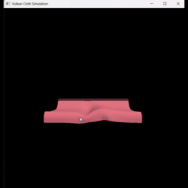

# Vulkan Cloth Simulator

A real-time, GPU-accelerated 3D cloth simulation built with Vulkan and C++. This project models a stable mass-spring-damper system over a 32×32 particle grid, featuring procedural aerodynamics and real-time mouse interaction.

## Overview

This project was developed to implement stable, high-stiffness physical constraints and complex environmental interactions entirely on the GPU. By offloading all physics — spring forces, surface normal computation, aerodynamic drag, and wind — to a GLSL Compute Shader, and binding the output SSBO directly as a Vertex Buffer, the simulation completely bypasses expensive CPU-GPU data roundtrips.

## Key Features

- **Real-Time Interactivity:** Users can click and drag to apply a localized spring force to the cloth, allowing for stable grabbing and pulling without particle teleportation.
- **GPU Compute Shader:** All physics integration, constraint resolution, and normal computation are offloaded entirely to a custom GLSL compute shader compiled to SPIR-V.
- **Ping-Pong Storage Buffers:** Two device-local SSBOs swap roles each sub-step — one read as current state, one written as next — eliminating in-place update hazards without any CPU readback.
- **Sub-Stepped Stability:** Executes 10 physics iterations per visual frame, allowing the simulation to handle high spring stiffness coefficients without numerical explosions.
- **Procedural Wind System:** A GPU-evaluated spatiotemporal function generates dynamic gusts with configurable direction, strength, speed, and scale, driving natural ripple motion across the cloth surface.

## The Mathematics

Structural integrity is maintained via three spring constraint types — Structural (1× rest length), Bend (2× rest length to resist folding), and Shear (diagonal neighbours to resist twisting) — all modelled with Hooke's Law:

$$\mathbf{F}_s = k \left(|\mathbf{d}| - L_0\right) \hat{\mathbf{d}}$$

Aerodynamic forces are computed based on the particle's surface orientation relative to the incoming wind velocity:

$$\mathbf{V}_{rel} = \mathbf{V}_{wind} - \mathbf{V}_{particle}$$

$$\mathbf{F}_{wind} = C_d \cdot (\hat{n} \cdot \mathbf{V}_{rel}) \cdot \hat{n}$$

Smooth surface normals are computed inside the compute pass using Central Differences, clamped safely at boundaries:

$$\mathbf{T}_x = P_{right} - P_{left}, \quad \mathbf{T}_y = P_{down} - P_{top}$$

$$\hat{n} = \text{normalize}(\mathbf{T}_x \times \mathbf{T}_y)$$

The entire system is integrated using Semi-Implicit Euler, using the updated velocity to compute the new position — conserving energy better than standard explicit Euler and keeping the simulation stable under stiff constraints:

$$\mathbf{v}(t + \Delta t) = \mathbf{v}(t) + \mathbf{a}(t)\,\Delta t$$

$$\mathbf{x}(t + \Delta t) = \mathbf{x}(t) + \mathbf{v}(t + \Delta t)\,\Delta t$$

## Real-Time Interactive Demo

*Sub-stepped GPU physics allows for real-time simulation of a 32×32 particle cloth at 60 FPS.*

## Acknowledgments

A massive thank you to [Sascha Willems](https://github.com/SaschaWillems/Vulkan) for his incredible open-source Vulkan C++ examples. His repositories were an invaluable resource for understanding Vulkan's synchronization, pipeline setup, and memory management architecture.
